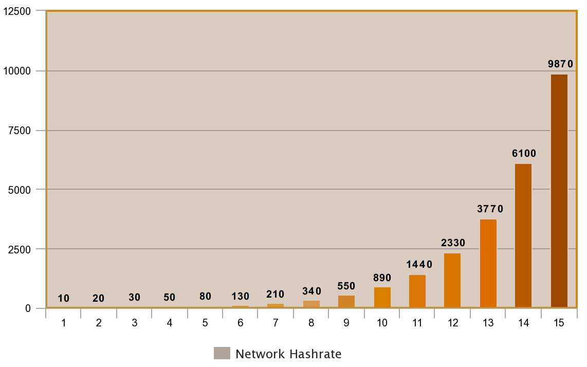
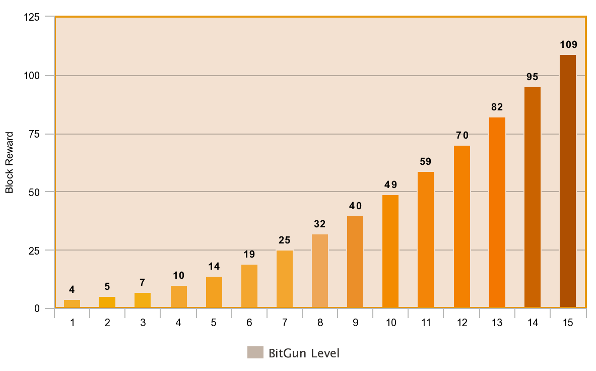
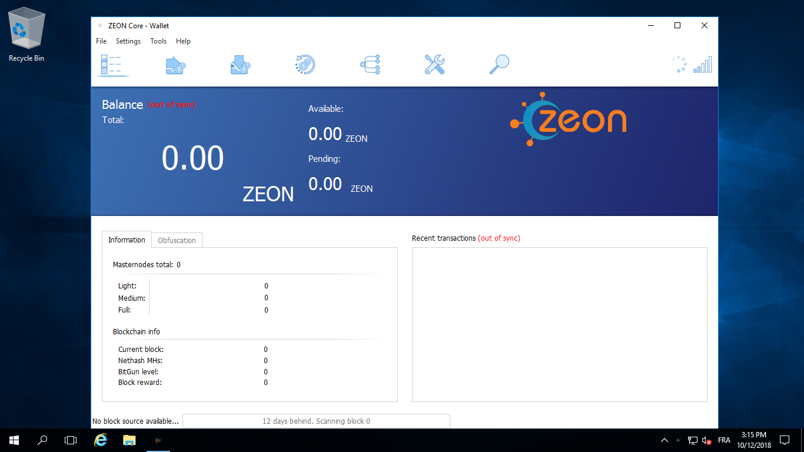
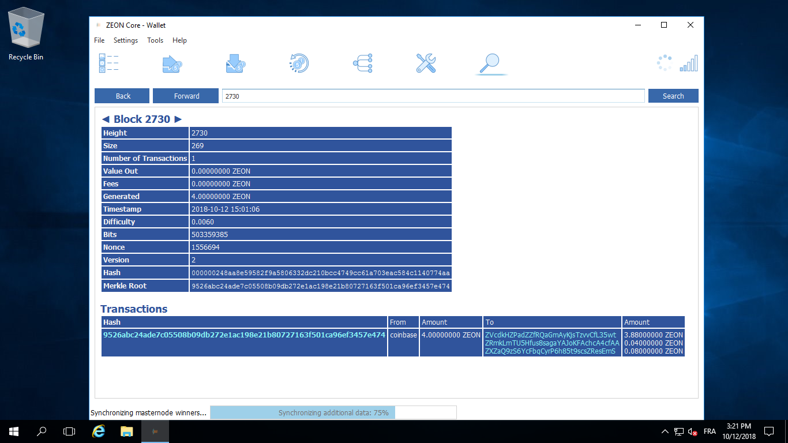
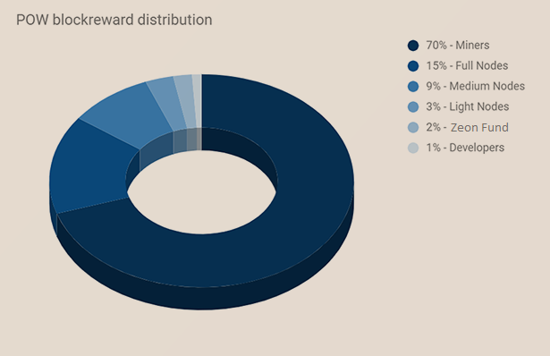
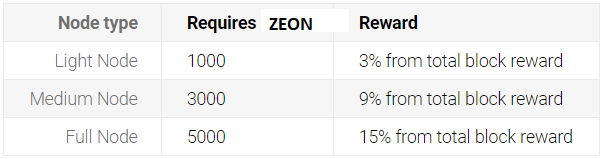
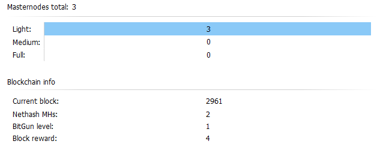

ZEON Core integration/staging repository
=====================================

ZEON  is a brand new digital currency that combines all the positive aspects of successful digital currencies, while taking into account their flaws and weak points. The project brings tangible benefits not only to the digital world but also to the real one.

More information at [https://pubfred.github.io/Zeon_hex/](https://pubfred.github.io/Zeon_hex/).

If you like our Idea, feel free to contact us and work with us. 

### Coin Specs

<table>
<tr><td>Name & ticker</td><td> Zeon (ZEON)</td></tr>
<tr><td>Consensus algorithm</td><td>PoW/POS</td></tr>
<tr><td>POW phase duration</td><td>777000 blocks</td></tr>
<tr><td>PoW block reward</td><td>Dynamic from 4 to 109 ZEON</td></tr>
<tr><td>Instamine protection</td><td>First 720 blocks</td></tr>
<tr><td>Hashing algorithm</td><td>HEX</td></tr>
<tr><td>Estimated ZEON supply during POW</td><td>80,000,000</td></tr>
<tr><td>POS starting block</td><td>777001</td></tr>
<tr><td>POS phase duration</td><td>Unlimited for now</td></tr>
<tr><td>POS block reward</td><td>24 ZEON lowering by 4 coins every 525600 blocks until block reward is 1 ZEON</td></tr>
<tr><td>POS block reward distribution</td><td>SeeSaw</td></tr>
<tr><td>Estimated ZEON supply during 15 years of POS</td><td>47,000,000</td></tr>
<tr><td>Premine</td><td> 400 000  ZEON (0.5 % of total supply )</td></tr>
<tr><td>Blocksize</td><td>1 MB</td></tr>
<tr><td>Blocktime average</td><td>1 min (DGW3)</td></tr>
<tr><td>Number of transaction confirmations</td><td>6</td></tr>
<tr><td>Maturity</td><td>60 confirmations</td></tr>
</table>

### Block reward for the BitGun Algo (Thanks goes to XDNA-Devs!)

<table>
<tr><th>Level</th><th>Network hashrate (Gh/s)</th><th>Block reward</th></tr>
<tr><th>1</th><th>0</th><th>4</th></tr>
<tr><th>2</th><th>20</th><th>5</th></tr>
<tr><th>3</th><th>30</th><th>7</th></tr>
<tr><th>4</th><th>50</th><th>10</th></tr>
<tr><th>5</th><th>80</th><th>14</th></tr>
<tr><th>6</th><th>130</th><th>19</th></tr>
<tr><th>7</th><th>210</th><th>25</th></tr>
<tr><th>8</th><th>340</th><th>32</th></tr>
<tr><th>9</th><th>550</th><th>40</th></tr>
<tr><th>10</th><th>890</th><th>49</th></tr>
<tr><th>11</th><th>1440</th><th>59</th></tr>
<tr><th>12</th><th>2330</th><th>70</th></tr>
<tr><th>13</th><th>3770</th><th>82</th></tr>
<tr><th>14</th><th>6100</th><th>95</th></tr>
<tr><th>15</th><th>9870</th><th>109</th></tr>
</table>

<table>
<tr><th>    </th><th>   </th></tr>
</table>

### Zeon_hex

Feel free to download release here : 
[https://github.com/Pubfred/Zeon_hex](https://github.com/Pubfred/Zeon_hex)

### Explorer include in wallet 

### POW block reward distribution

### Masternode 3 levels 

### Status 21 October 

