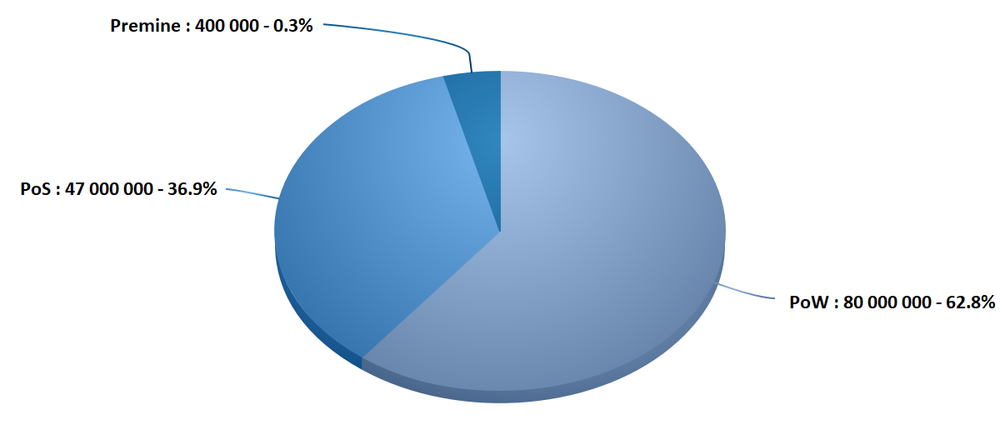
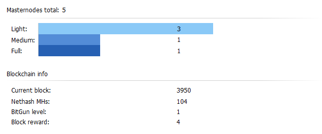

ZEON Core integration/staging repository
=====================================

ZEON  is a brand new digital currency that combines all the positive aspects of successful digital currencies, while taking into account their flaws and weak points. The project brings tangible benefits not only to the digital world but also to the real one.

More information at [https://pubfred.github.io/Zeon_hex/](https://pubfred.github.io/Zeon_hex/).

If you like our Idea, feel free to contact us and work with us. 

### Coin Specs

<table>
<tr><td>Name & ticker</td><td> Zeon (ZEON)</td></tr>
<tr><td>Consensus algorithm</td><td>PoW/POS</td></tr>
<tr><td>POW phase duration</td><td>777000 blocks</td></tr>
<tr><td>PoW block reward</td><td>Dynamic from 4 to 109 ZEON</td></tr>
<tr><td>Target block time</td><td>60 s</td></tr>
<tr><td>Instamine protection</td><td>First 720 blocks</td></tr>
<tr><td>Hashing algorithm</td><td>HEX</td></tr>
<tr><td>Estimated ZEON supply during POW</td><td>80,000,000</td></tr>
<tr><td>POS starting block</td><td>777001</td></tr>
<tr><td>POS phase duration</td><td>Unlimited for now</td></tr>
<tr><td>POS block reward</td><td>24 ZEON lowering by 4 coins every 525600 blocks until block reward is 1 ZEON</td></tr>
<tr><td>POS block reward distribution</td><td>SeeSaw</td></tr>
<tr><td>Estimated ZEON supply during 15 years of POS</td><td>47,000,000</td></tr>
<tr><td>Premine</td><td> 400 000  ZEON (0.3 % of total supply )</td></tr>
<tr><td>Blocksize</td><td>1 MB</td></tr>
<tr><td>Blocktime average</td><td>1 min (DGW3)</td></tr>
<tr><td>Number of transaction confirmations</td><td>6</td></tr>
<tr><td>Maturity</td><td>60 confirmations</td></tr>
</table>

### Block reward for the BitGun Algo (Thanks goes to XDNA-Devs!)

<table>
<tr><th>Level</th><th>Network hashrate (Gh/s)</th><th>Block reward</th></tr>
<tr><th>1</th><th>0</th><th>4</th></tr>
<tr><th>2</th><th>20</th><th>5</th></tr>
<tr><th>3</th><th>30</th><th>7</th></tr>
<tr><th>4</th><th>50</th><th>10</th></tr>
<tr><th>5</th><th>80</th><th>14</th></tr>
<tr><th>6</th><th>130</th><th>19</th></tr>
<tr><th>7</th><th>210</th><th>25</th></tr>
<tr><th>8</th><th>340</th><th>32</th></tr>
<tr><th>9</th><th>550</th><th>40</th></tr>
<tr><th>10</th><th>890</th><th>49</th></tr>
<tr><th>11</th><th>1440</th><th>59</th></tr>
<tr><th>12</th><th>2330</th><th>70</th></tr>
<tr><th>13</th><th>3770</th><th>82</th></tr>
<tr><th>14</th><th>6100</th><th>95</th></tr>
<tr><th>15</th><th>9870</th><th>109</th></tr>
</table>

       

### Zeon_hex

Feel free to download release here : 
[https://github.com/Pubfred/Zeon_hex](https://github.com/Pubfred/Zeon_hex)

### Explorer include in wallet 

### POW block reward distribution

### Masternode 3 levels 

### Status 21 October 

### Status 21 October 5 PM

<section class="map" id="roadmap">
    

        <h1 class="map-title f-bold">Road map</h1>
        

            

                
April 2018 MVP release

                
Ethereum and Bitcoin asset management ERC20 tokens support Integrated instant exchange service

            

            

                
May 2018 Beta release

                
First pair for Atomic swaps Litecoin asset management

            

            

                
June 2018

                
QTUM swap 10 new assets in the wallet Custom token Market price order Atomic Swap UI improvements

            

            

                
July 2018

                
3 new assets support
                         Auto response on swap request
                         Swaps and orderbook stability impovements
                         UI Improvements
                         Errors log file

            

            

                
August 2018

                
Notification about new version  BTG, TPAY, DOGE in the wallet
                 Instant Exchange update 

            

            

                
September 2018

                
Instant Exchange History
                 6 new assets in the wallet.
                 UI/UX improvements.
                 Buy crypto with a card (alpha).

            

             

                
October 2018

                
Mobile wallet for Android - alpha realease
                 4 new assets in the wallet
                 Buy crypto with a card (release).
                 Instant Exchange performance improvement

            

            

                
November 2018

                
Mobile wallet for Android - beta realease
                 4 new assets in the wallet

            

            

                
December 2018

                
Mobile wallet for iOS - first build.
                 4 new assets in the wallet
                

            

           
        

    

</section>

