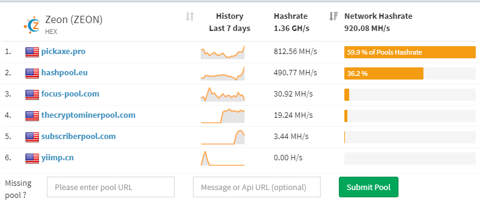
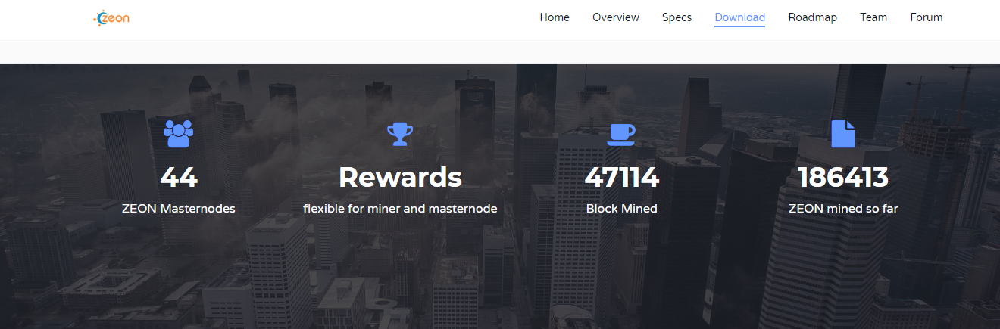

                	

𝙃𝙖𝙥𝙥𝙮 𝙗𝙞𝙧𝙩𝙝𝙙𝙖𝙮 𝙕𝙚𝙤𝙣

  

ZEON Core integration/staging repository
=====================================

ZEON  is a brand new digital currency that combines all the positive aspects of successful digital currencies, while taking into account their flaws and weak points. The project brings tangible benefits not only to the digital world but also to the real one.

More information at [https://pubfred.github.io/Zeon_hex/](https://pubfred.github.io/Zeon_hex/).

If you like our Idea, feel free to contact us and work with us. 

### Coin Specs

<table>
<tr><td>Name & ticker</td><td> Zeon (ZEON)</td></tr>
<tr><td>Consensus algorithm</td><td>PoW/POS</td></tr>
<tr><td>POW phase duration</td><td>777000 blocks</td></tr>
<tr><td>PoW block reward</td><td>Dynamic from 4 to 109 ZEON</td></tr>
<tr><td>Target block time</td><td>60 s</td></tr>
<tr><td>Instamine protection</td><td>First 720 blocks</td></tr>
<tr><td>Hashing algorithm</td><td>HEX</td></tr>
<tr><td>Estimated ZEON supply during POW</td><td>‭3,105,840‬</td></tr>
<tr><td>POS starting block</td><td>777001</td></tr>
<tr><td>POS phase duration</td><td>Unlimited for now</td></tr>
<tr><td>POS block reward</td><td>5 ZEON lowering by 1 coins every year until block reward is 1 ZEON</td></tr>
<tr><td>POS block reward distribution</td><td>SeeSaw</td></tr>
<tr><td>Estimated ZEON supply during 15 years of POS</td><td>47,000,000</td></tr>
<tr><td>Premine</td><td> 400 000  ZEON (0.3 % of total supply )</td></tr>
<tr><td>Blocksize</td><td>1 MB</td></tr>
<tr><td>Blocktime average</td><td>1 min (DGW3)</td></tr>
<tr><td>Number of transaction confirmations</td><td>6</td></tr>
<tr><td>Maturity</td><td>60 confirmations</td></tr>
</table>

### Block reward for PoS (assuming current PoW rate)

<table>
<tr><th>Starting Block</th><th>Ending Block</th><th>Block Reward</th><th>Total Supply</th><th>Phase Length</th></tr>
<tr><th>777,001</th><th>778,441 </th><th>1</th><th>‭3,107,280‬</th><th>1 day</th></tr>
<tr><th>778,441</th><th>‭1,302,600‬</th><th>5</th><th>‭5,728,075‬</th><th>52 weeks</th></tr>
<tr><th>1,302,601</th><th>‭1,828,200‬</th><th>4</th><th>‭7,830,471‬</th><th>52 weeks</th></tr>
<tr> </tr> 
<tr><th>1,828,201</th><th>2,879,400</th><th>3</th><th>10,984,068</th><th>104 weeks</th></tr>
<tr><th>2,879,401</th><th>3,405,000</th><th>2</th><th>12,035,266</th><th>52 weeks</th></tr>
 
<tr><th>3,405,001</th><th> ...‬ </th><th>1</th><th>MAX</th><th> ... </th></tr>
</table>

       

### Zeon_hex

Feel free to download release here : 
[https://github.com/Pubfred/Zeon_hex](https://github.com/Pubfred/Zeon_hex)

### Explorer include in wallet 

### POW block reward distribution

### Masternode 3 levels 

### Masternode Host & Share

Host:         
https://ihostmn.com/

https://ihostmn.com/hostmn.php?coin=ZEON-1K 

https://ihostmn.com/hostmn.php?coin=ZEON-3K 

https://ihostmn.com/hostmn.php?coin=ZEON-5K 

### Status 21 October 

### Status 23 November 12 AM

### Roadmap preview    
https://zeonhexalgo.fun/roadmap.html

### Network Hasrate 

### Mining Pools Stats  
[https://poolexplorer.com/coin/5557](https://poolexplorer.com/coin/5557)

[https://miningpoolstats.stream/zeon](https://miningpoolstats.stream/zeon)

### Exchange ZEON 

[https://trade.zeonhexalgo.fun](https://trade.zeonhexalgo.fun)

[https://www.finexbox.com/Home/Orders/market/pair/ZEON-BTC](https://www.finexbox.com/Home/Orders/market/pair/ZEON-BTC)

 [https://openexchange24.com/market/BTC-ZEON?ref=3](https://openexchange24.com/market/BTC-ZEON)

 An Exchange and Autoexchnage for Miners on https://www.nlpool.nl

[https://tradebtc.zeonhexalgo.fun](https://tradebtc.zeonhexalgo.fun)

###   Main site for ZEON : 
[https://zeonhexalgo.fun/](https://zeonhexalgo.fun/)

 Main site for ZEON 28 November :

###   ZEON price chart  : 

###   ZEON Tip Bot on discord channel 
	

###   Masternode Info site for ZEON  :

https://masternode.zeonhexalgo.fun

	

###   Zeon coin Info   :

https://masternode.zeonhexalgo.fun/coininfo 

	

###   Zeon on MCT+ Platform   :

https://trade.mct.plus/

You can now exchange ZEON for 38 Other Cryptos ...

	

	

###   Zeon seeds 

https://dnschecker.org/#A/dnsseed2.zeonhexalgo.fun

	

###   Zeon Web Wallet

https://wallet.zeonhexalgo.fun/

	

###   Masternode Service 

[https://www.nodeasy.com/](https://www.nodeasy.com/)

	

###   Discord Bot Stats 

[https://discord.gg/xNQ3mQ9](https://discord.gg/xNQ3mQ9)

	

          ZEON earnings level3
               %earnings3

	

###   Markets 

[https://www.finexbox.com/market/pair/ZEON-BTC.html](https://www.finexbox.com/market/pair/ZEON-BTC.html)

	

[https://altmarkets.io/trading/zeonbtc](https://altmarkets.io/trading/zeonbtc)

	

BTC , LTC and BTCZ  pairs  on 

[ https://cratex.io]( https://cratex.io)

	

